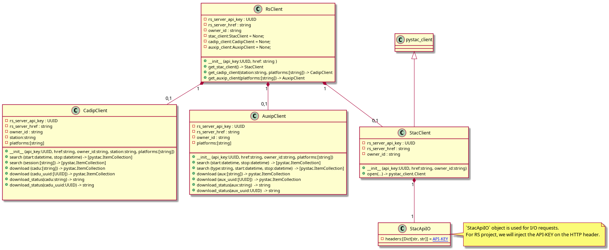
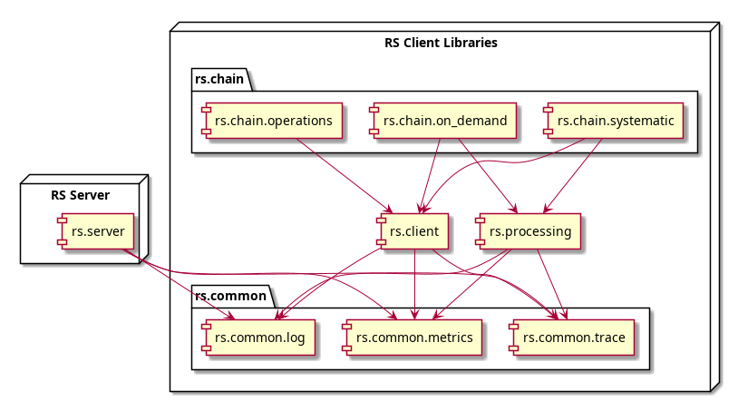

RS Client Libraries
===================

# Overview

The RsClient class is a base class for interacting with an RS-Server. It provides methods for managing and retrieving information about various resources and stations available on the server. The class includes methods for checking file download statuses, staging files for download, and searching for files within specified time ranges. It also provides methods for creating instances of its child classes: AuxipClient, CadipClient, and StacClient.

