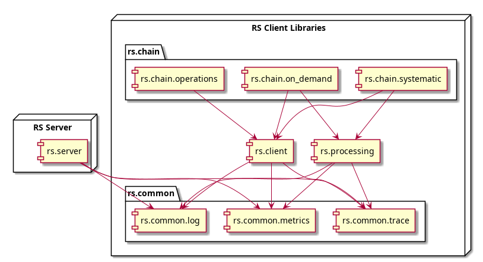
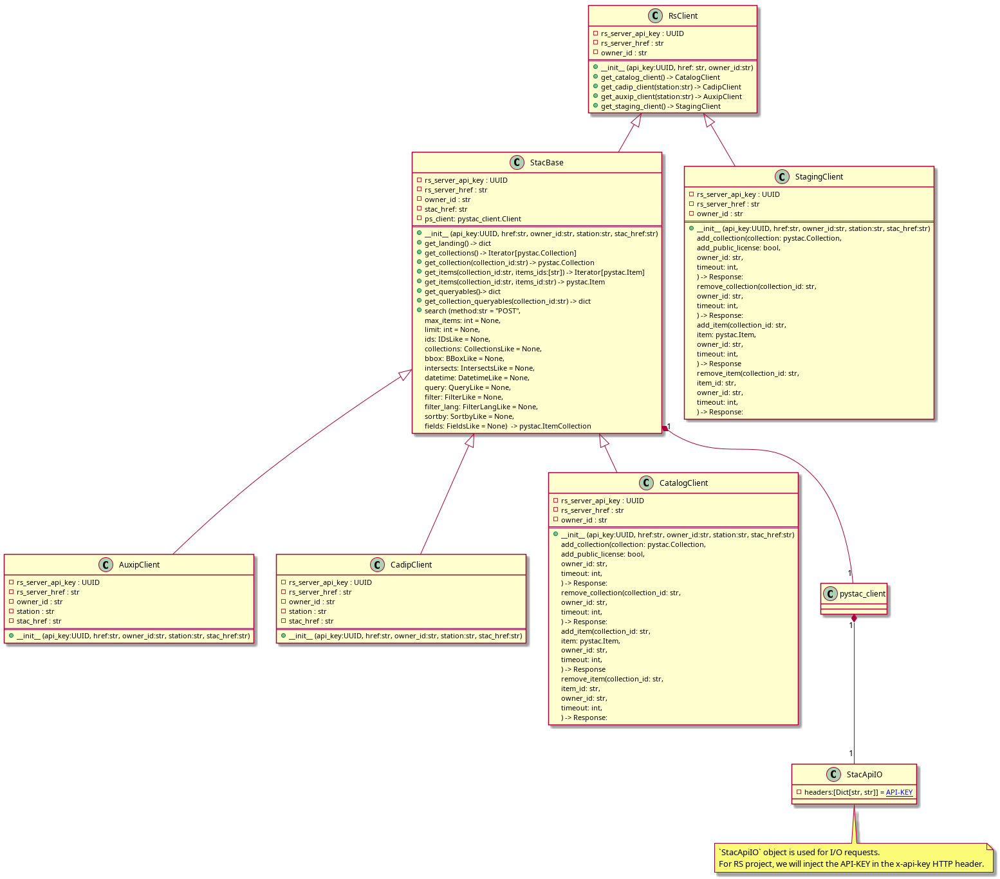

# RS Client Libraries overview

The RS-Client library enables users to interact with all RS-Server services. It consists of the base class RsClient, two subclasses extending it: StagingClient and StacBase, and three additional subclasses of StacBase: CadipClient and AuxipClient for STAC read operations, and CatalogClient for both read and write operations.

The **RsClient** class is a base class for interacting with the RS-Server. It provides the the check of the user's API key. It also provides methods for creating instances of its child classes: AuxipClient, CadipClient, CatalogClient and StagingClient.

The **StagingClient** class extends the RsClient class and provides specific functionality for interfacing with the RS-Server Staging endpoints.

The **StacBase** class extends the RsClient class, providing read methods for interacting with RS-Server CADIP, RS-Server AUXIP, and RS-Server Catalog using the STAC (SpatioTemporal Asset Catalog) protocol. It achieves this by aggregating a [pystac-client](https://pystac-client.readthedocs.io/en/stable/) object. This class facilitates retrieving STAC collections, items, and queryables while also supporting search operations using filter expressions. It abstracts the complexities of interacting with the STAC API, ensuring seamless integration with RS-Server endpoints. Additionally, **StacBase** includes error handling through a decorator that catches and logs APIError exceptions raised by the **pystac-client**, improving the robustness of API interactions. By leveraging caching mechanisms for frequently accessed data, such as collections, **StacBase** optimizes performance while maintaining compatibility with the STAC API specifications.

The **AuxipClient** class extends the StacBase class to provide a specialized interface for interacting with RS-Server AUXIP endpoints. It is designed to facilitate access to auxiliary data by integrating station-specific configurations while maintaining compatibility with the STAC API. By inheriting from StacBase, the **AuxipClient** retains all standard STAC-based query capabilities, such as retrieving collections, items, and search functionality, while adding AUXIP specific behavior.

The **CadipClient** class extends the StacBase class to provide a specialized interface for interacting with RS-Server CADIP endpoints. It is designed to facilitate access to sessions data by integrating station-specific configurations while maintaining compatibility with the STAC API. By inheriting from StacBase, the **CadipClient** retains all standard STAC-based query capabilities, such as retrieving collections, items, and search functionality, while adding CADIP specific behavior.

The **CatalogClient** class extends the StacBase class to offer a specialized interface for interacting with the RS-Server Catalog service, simplifying the use of REST endpoints for both reading and writing STAC data. It introduces support for STAC write operations (such as add_collection, remove_collection, add_item, and remove_item functions) which are not natively available in pystac-client, enabling users to manage collections and items directly within the RS-Server catalog.

